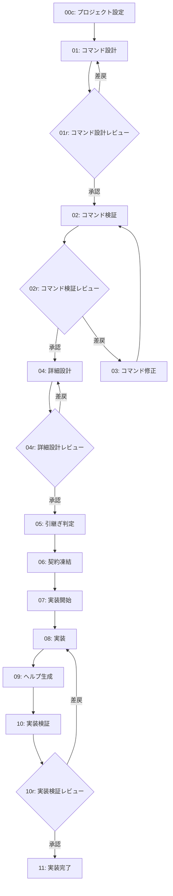

# CLI Contract Framework - 開発フロー

**フレームワーク**: CLI Contract Framework
**バージョン**: 1.0.0
**概要**: CLI開発フレームワーク。コマンド設計→実装→ヘルプ生成の流れ

---

## ワークフロー概要



---

## フェーズ一覧

| # | フェーズ | 担当 | 成果物 | 推奨ツール |
|---|----------|------|--------|------------|
| 00c | プロジェクト設定 | 設計 | project-config.yml | Claude |
| 01 | コマンド設計 | 設計 | コマンド仕様書 | Claude |
| 01r | コマンド設計レビュー | **人間** | 承認/指摘 | - |
| 02 | コマンド検証 | 設計 | 検証レポート | Claude |
| 02r | コマンド検証レビュー | **人間** | 承認/指摘 | - |
| 03 | コマンド修正 | 設計 | 修正済み仕様 | Claude |
| 04 | 詳細設計 | 設計 | 入出力仕様、エラーコード | Claude |
| 04r | 詳細設計レビュー | **人間** | 承認/指摘 | - |
| 05 | 引継ぎ判定 | 設計 | 判定結果 | Claude |
| 06 | 契約凍結 | 設計 | 凍結宣言 | Claude |
| 07 | 実装開始 | 実装 | 実装計画 | Codex |
| 08 | 実装 | 実装 | CLIコマンド | Codex |
| 09 | ヘルプ生成 | 実装 | ヘルプテキスト | Codex |
| 10 | 実装検証 | 実装 | 検証レポート | Codex |
| 10r | 実装検証レビュー | **人間** | 承認/指摘 | - |
| 11 | 実装完了 | 実装 | 完了報告 | Codex |

---

## ロール定義

### {{DESIGN_ROLE}}（設計担当）

#### 責務
- CLI仕様書（`{{CLI_SPEC_DIR}}/`）の作成・管理
- コマンド体系の設計
- {{IMPL_ROLE}} への仕様説明

#### 権限
- `{{CLI_SPEC_DIR}}/` 配下のファイル作成・編集・削除

#### 禁止事項
- `{{IMPL_DIR}}/` 配下のファイル変更
- `{{TEST_DIR}}/` 配下のファイル変更
- 実装コードの記述

---

### {{IMPL_ROLE}}（実装担当）

#### 責務
- 凍結されたコマンド仕様に基づく実装
- ヘルプテキストの生成
- 実装上の問題発見時の報告

#### 権限
- `{{IMPL_DIR}}/` 配下のファイル作成・編集・削除
- `{{TEST_DIR}}/` 配下のファイル作成・編集・削除

#### 禁止事項
- `{{CLI_SPEC_DIR}}/` 配下のファイル変更
- コマンド仕様の解釈・補完・変更
- 仕様にないコマンドの追加

---

## 仕様問題発見時の停止・差し戻し手順

### {{IMPL_ROLE}} が問題を発見した場合

```
1. 即座に作業を停止
2. 以下の形式で報告:

   STOP: SPEC ISSUE FOUND

   問題箇所: [仕様書パス:行番号]
   問題内容: [具体的な問題の説明]
   影響範囲: [この問題が影響する実装範囲]

3. {{DESIGN_ROLE}} の修正を待つ
4. 修正された仕様を確認後、実装を再開
```

---

## 成果物

### コマンド設計フェーズ
- `{{CLI_SPEC_DIR}}/commands.yml` - コマンド一覧
- `{{CLI_SPEC_DIR}}/options.yml` - グローバルオプション

### 詳細設計フェーズ
- `{{CLI_SPEC_DIR}}/detail/` - コマンド詳細仕様
- `{{CLI_SPEC_DIR}}/detail/io-spec.yml` - 入出力仕様
- `{{CLI_SPEC_DIR}}/detail/errors.yml` - エラーコード定義

### 実装フェーズ
- `{{IMPL_DIR}}/` - CLIコマンド実装
- `{{TEST_DIR}}/` - テストコード
- 組み込みヘルプ（--help）

---

## ヘルプ形式

```
Usage: {{PROJECT_NAME}} <command> [options]

Commands:
  init    プロジェクトを初期化
  run     コマンドを実行

Options:
  -h, --help     ヘルプを表示
  -v, --version  バージョンを表示
```

---

## 改訂履歴

| 日付 | 内容 |
|------|------|
| 2026-02-02 | 初版作成（CLI Contract Frameworkより自動生成） |
